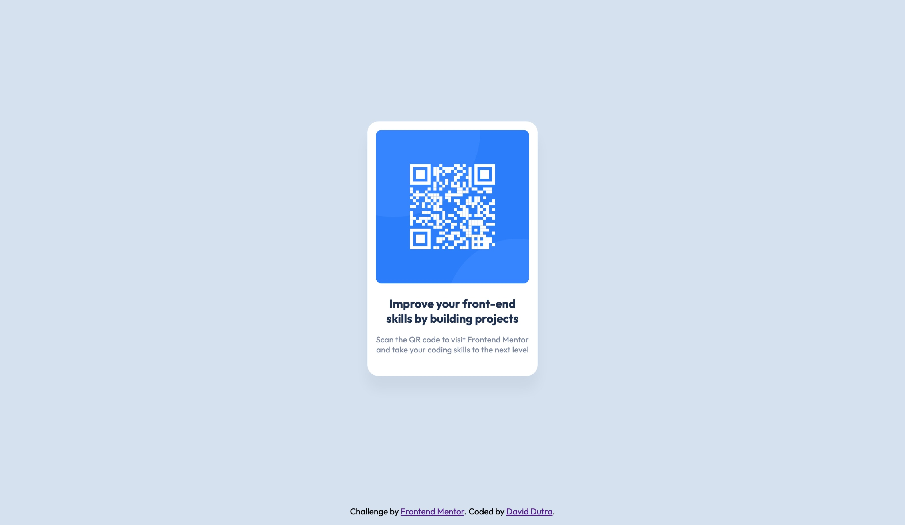

# Frontend Mentor - QR code component solution

This is a solution to the [QR code component challenge on Frontend Mentor](https://www.frontendmentor.io/challenges/qr-code-component-iux_sIO_H). Frontend Mentor challenges help you improve your coding skills by building realistic projects. 

## Table of contents

- [Overview](#overview)
  - [Screenshot](#screenshot)
  - [Links](#links)
- [My process](#my-process)
  - [Built with](#built-with)
  - [What I learned](#what-i-learned)

## Overview

### Screenshots

<figure>
  <figcaption>Desktop Screenshot</figcaption>
  
</figure>
<figure>
  <figcaption>Mobile Screenshot</figcaption>
  
</figure>

### Links

- Live Demo: [QR Code Component](https://dvdgd.github.io/qr-code-component)

## My process

### Built with

- HTML
- CSS
- Flexbox

### What I learned

Use the Flexbox display model to align the card in the center and still have a footer on the bottom by giving the main html a flex value of 1.

```html
<body>
  <main></main>
  <footer></footer>
</body>
```
```css
body {
  display: flex;
  flex-direction: column;
  height: 100vh;
}

main {
  display: flex;
  flex: 1;
  height: 100%;
}
```
